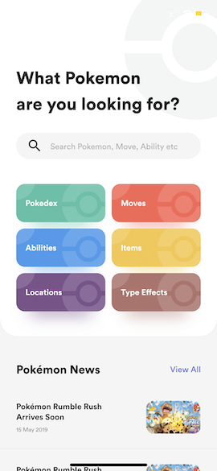
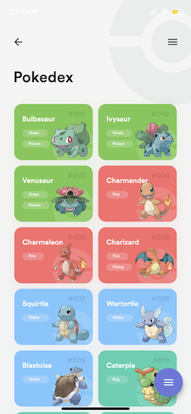
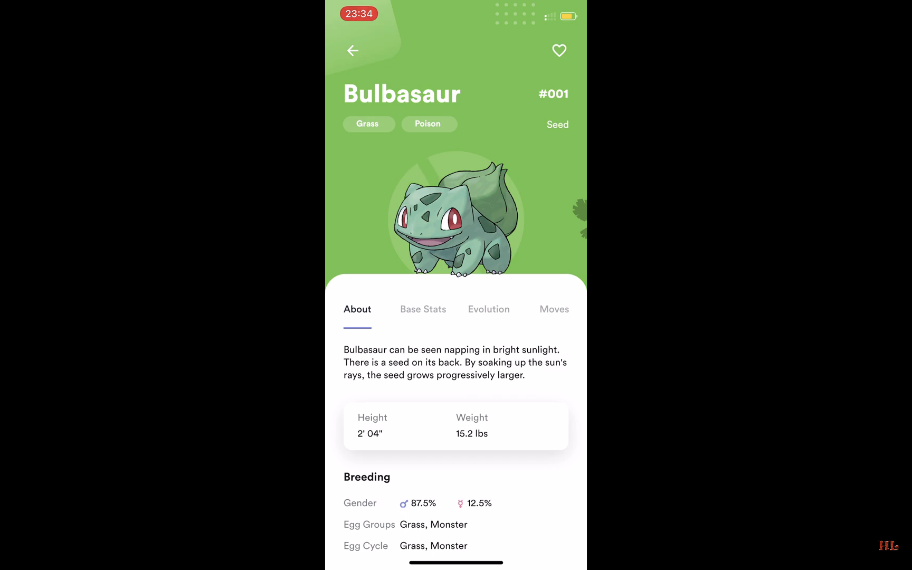

# Flutter Pokedex

Pokedex app built with Flutter

## App preview

")

## Video demo

## Installation

- Add [Flutter](https://flutter.dev/docs/get-started/install) to your machine

- Open this project folder with Terminal/CMD and run `flutter packages get`

- Run `flutter run` to build and run the debug app on your emulator/phone

## License

All the code available under the MIT + Apache 2.0. licenses. See [LICENSE](LICENSE).
